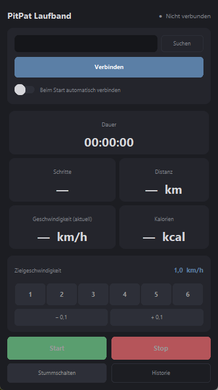

# PitPat Treadmill Tray

Simple Windows tray control for the PitPat treadmill BA09-B.

Einfache Windows-Tray-Steuerung für das PitPat Laufband BA09-B.

Support / Unterstützung:
https://ko-fi.com/heilmic

## Download

If you just want to use the app on Windows, download the latest packaged release.

Wenn du die App einfach unter Windows nutzen möchtest, nimm die fertige Release-Version.

Current release:
- https://github.com/heilmic/treadmill-tray/releases/latest

Current release file in this repo:
- `release/treadmill-tray-v0.4.0-win64.zip`

## English

PitPat Treadmill Tray is a small Windows app for normal users who want to control their PitPat treadmill BA09-B without extra clutter.

It is made for people who want:
- a simple Bluetooth connection
- quick Start / Pause / Stop controls
- direct speed buttons from 1 to 6 km/h
- small 0.1 km/h speed adjustments
- sound mute / unmute
- a small local workout history

Why this app?
- no cloud account
- no big dashboard
- no unnecessary extras
- focused on practical everyday use on Windows

Requirements:
- Windows
- Bluetooth enabled
- PitPat treadmill BA09-B

Quick start:
1. Start the app
2. Click "Suchen"
3. Select your treadmill
4. Click "Verbinden"
5. Use Start / Pause / Stop and the speed buttons

Good to know:
- workout history is stored locally on your PC
- this project is unofficial and not affiliated with PitPat
- use it at your own risk

For technical details, build instructions and protocol notes:
- see [technical.md](technical.md)

## Deutsch

PitPat Treadmill Tray ist eine kleine Windows-App für normale Anwender, die ihr PitPat Laufband BA09-B einfach und ohne unnötigen Ballast steuern möchten.

Die App ist gedacht für Menschen, die wollen:
- eine einfache Bluetooth-Verbindung
- schnelle Start / Pause / Stop-Steuerung
- direkte Geschwindigkeitsbuttons von 1 bis 6 km/h
- kleine Anpassungen in 0,1-km/h-Schritten
- Ton stummschalten oder wieder aktivieren
- eine kleine lokale Trainingshistorie

Warum diese App?
- kein Cloud-Konto
- kein großes Dashboard
- keine unnötigen Extras
- Fokus auf praktische Nutzung unter Windows

Voraussetzungen:
- Windows
- Bluetooth aktiviert
- PitPat Laufband BA09-B

Schnellstart:
1. App starten
2. Auf "Suchen" klicken
3. Laufband auswählen
4. Auf "Verbinden" klicken
5. Start / Pause / Stop und die Geschwindigkeitsbuttons nutzen

Gut zu wissen:
- die Trainingshistorie wird lokal auf deinem PC gespeichert
- dieses Projekt ist inoffiziell und steht in keiner Verbindung zu PitPat
- Nutzung auf eigenes Risiko

Für technische Details, Build-Hinweise und Protokollnotizen:
- siehe [technical.md](technical.md)
